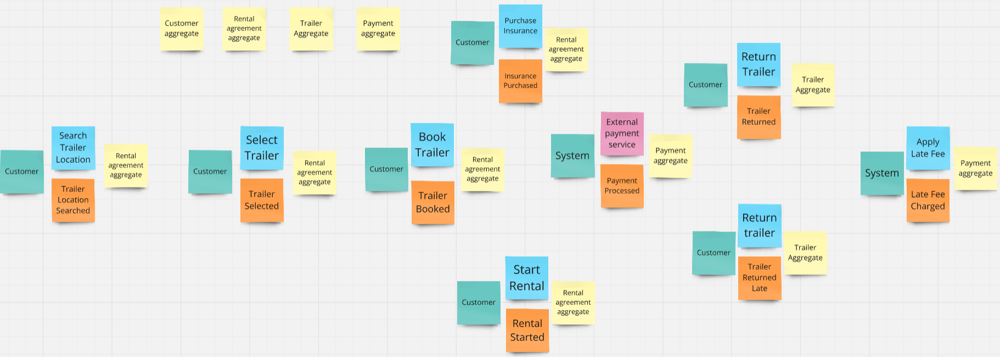
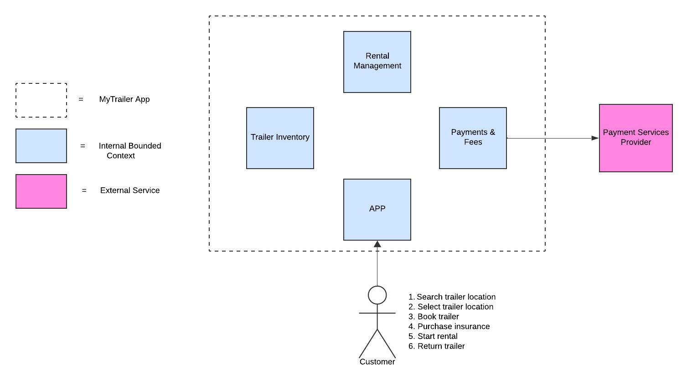
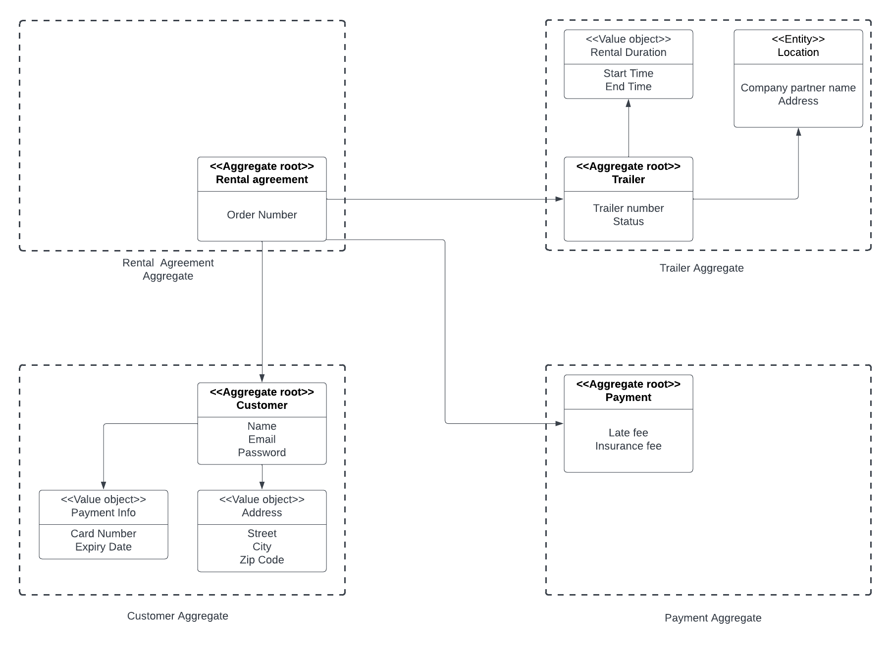

# Table of Contents
- [Table of Contents](#table-of-contents)
  - [Event Storming](#event-storming)
  - [Ubiquitous Language](#ubiquitous-language)
  - [Bounded Context](#bounded-context)
  - [System diagram with bounded contexts](#system-diagram-with-bounded-contexts)
  - [Aggregates](#aggregates)

---

## Event Storming
Billedet herunder er af vores digitale event storming board. Vi brugte event storming sammen i gruppen til at danne os et overblik over funktionaliteten i systemet, og finde vores domain events. Der kan og er oftest flere aggregates til hvert domain event, dem som står ved et domain event er dem som er core aggretates til det event.
Farverne er inddelt efter kategorier:
- <code style="color:orange">Orange</code> - Domain event
- Blå - Commands
- Tyrkis - Actor
- Gul - Aggregate
- Pink - External system

---

## Ubiquitous Language

1. **Customer**  
   - A person who uses the MyTrailer app to rent a trailer. Customers can choose trailers at various locations and rent them for a specific period. They can also purchase insurance for the trailer.

2. **Trailer**  
   - A vehicle attachment that is rented by the customer to transport goods. Each trailer has a unique identifier (Location ID and Trailer Number) and can be rented for a maximum period of 24 hours.

3. **Location**  
   - A place where trailers are parked and available for rental. Locations could be stores like "Jem og Fix" or "Fog". Each location has its own ID and is associated with trailers.

4. **Booking**  
   - The act of reserving a specific trailer for a certain period through the app. Customers book trailers based on location and trailer availability.

5. **Rental Agreement**  
   - A contract created when a customer books a trailer. It defines the trailer, rental duration, insurance options, and any fees associated with the rental (e.g., late fees).

6. **Short-term Rental**  
   - A rental period of less than 24 hours, which must be completed by midnight on the same day. This is the most common type of rental on the MyTrailer app.

7. **Long-term Rental**  
   - A rental period that includes overnight usage. Long-term rentals cannot be booked via the app but are reserved through the website. These trailers are located at specialist locations.

8. **Insurance**  
   - An optional service that the customer can purchase to protect against damage or theft of the trailer. The cost of insurance is typically 50 Kr and most customers purchase it.

9. **Late Fee**  
   - An additional charge applied when a trailer is returned after the agreed-upon time. The late fee is automatically added to the customer's bill as part of the Rental Agreement.

10. **Trailer Returned Late**  
    - An event triggered when a trailer is not returned by the agreed-upon return time, thus incurring a late fee.

11. **Trailer Status**  
    - The current state of the trailer (e.g., "available," "rented," "under maintenance"). The status is updated when the trailer is booked, rented, or returned.

12. **Payment**  
    - The process where the customer settles the fees associated with their rental, including any insurance or late fees. Payments are processed via an external payment service.

13. **Rental Period**  
    - The duration for which the customer rents the trailer. It can be a short-term rental (up to 24 hours) or a long-term rental (overnight).

14. **Trailer Location Searched**  
    - An event where the customer searches for available trailers at a given location using the app.

15. **Trailer Selected**  
    - An event where the customer selects a specific trailer for booking from a given location.

16. **Rental Start Time**  
    - The point in time when the customer begins using the rented trailer, which updates the status of the trailer to "rented."

17. **Trailer Return**  
    - The action of bringing the trailer back to the location once the rental period is over. The system will update the status of the trailer to "available."

18. **Payment Processed**  
    - An event that marks the successful processing of the customer’s payment for the trailer rental, insurance, and any applicable fees.

---

## Bounded Context

- Rental Management: Handling trailer reservations, rental periods, rental agreements, and trailer statuses.
- Trailer Inventory: Managing the trailers, their locations, availability, and movement.
- Payments and Fees: Processing payments, insurance, and applying late fees.
- App: The graphical user interface (GUI) for customers to search, book, and return trailers.
---

## System diagram with bounded contexts
This diagram shows the high-level architecture of the MyTrailer app, with the different bounded contexts. Each bounded context represents a specific subdomain within the system, such as Customer Management, Trailer Inventory, App and Payments & Fees.

---

## Aggregates
This a diagram of the aggregates we have found in our system. These are also visible in the event storming board.

